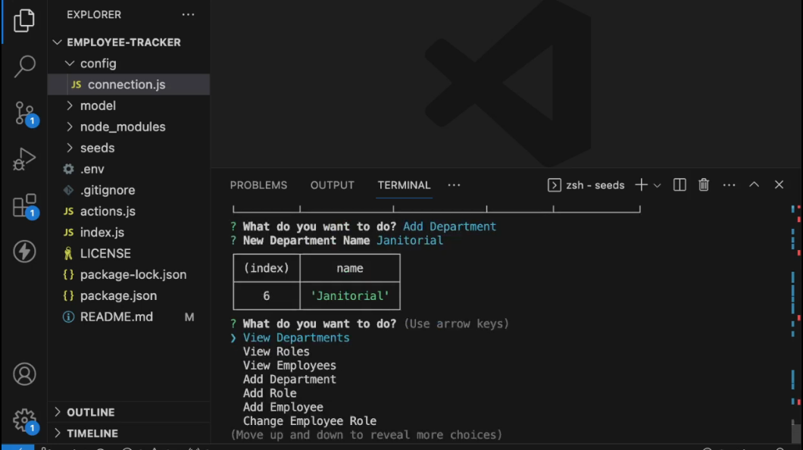

# Employee Tracker

 
 
A command line application that views and modifies an employee database of a business. Be able to add departments, roles, and employeess as well as viewing them.

Walkthrough:

 
## Table Of Contents
1. [Installation](#installation)
2. [Usage](#usage)
3. [License](#license)
4. [Contributing](#contributing)
5. [Tests](#tests)
6. [Questions](#questions)
 
### Installation
 
Be sure to have Node v18.18.0 or greater installed. Clone the repository using `git clone`. Head into the repository and run `npm install` to install the dependencies. To configure the application to connect to your MySQL database, create a .env file in the repository with these settings set: `DB_HOST`, `DB_USER`, `DB_NAME`, `DB_PASSWORD`. If you want to seed your database for testing, copy the `.env` file you've made into the seeds directory, and run `node seed.js`.
 
### Usage
 
To run the application, run `npm start`. You will be prompted with actions to choose from. Once chosen an action, you will be presented with data you've chosen for or prompted more inquiries to execute that action.
 
### License
 
 

This project in under the MIT license. Learn more about it here: https://opensource.org/licenses/MIT
 
### Contributing
 
Follow the same formatting when writing Javascript code. Write descriptive commits. Lastly, ask to merge to the `develop` branch instead of the `main` branch.
 
### Tests
 
Test the application on a local MySQL database. Run `node seed.js` in the seeds directory to fill your database with abritrary data. Now you are able to test the functionality of the app with the database.
 
### Questions
 
What is the link to my GitHub?
 
- Link to my GitHub profile: [https://github.com/elmfer](https://github.com/elmfer)
 
How can you contact me?
 
- Contact me through my email: [elmfer10@gmail.com](mailto:elmfer10@gmail.com)
